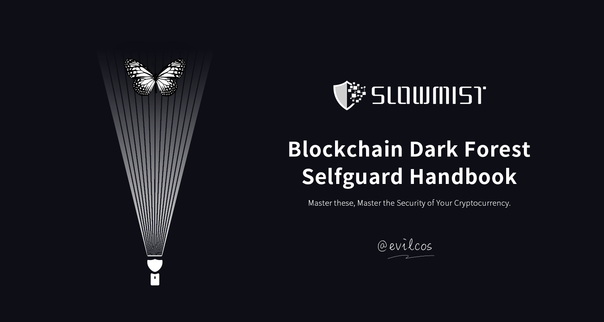
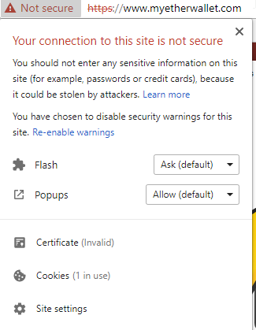

区块链黑暗森林自救手册<br>
*掌握这些，掌握你的加密货币安全。*

:us:English：[Blockchain dark forest selfguard handbook](README.md)

Blockchain dark forest selfguard handbook<br>
*Master these, master the security of your cryptocurrency.<br>*

作者：余弦@慢雾安全团队<br>
联系我：Twitter([@evilcos](https://twitter.com/evilcos))、即刻(@余弦.jpg)



| 日期 | 更新日志 |
| --- | --- |
| 2022/5/17 | V1 [英文版](README.md)出现，一点小修正，感谢翻译者们。 |
| 2022/4/15 | V1 出现，仅仅修正了点错别字，一些不错的建议，我将在之后的小版本里加入，感谢:) |
| 2022/4/12 | V1 Beta 出现，中文，用碎片时间断断续续写了三周:grinning: |

*注：选择 GitHub 方便协同及看到历史更新记录。你可以 Watch、Fork 及 Star，当然我更希望你能参与贡献:)*

:anchor:**目录**
- [引子](#引子)
- [一张图](#一张图)
    - [创建钱包](#创建钱包)
        - [Download](#download)
        - [Mnemonic Phrase](#mnemonic-phrase)
        - [Keyless](#keyless)
    - [备份钱包](#备份钱包)
        - [助记词/私钥类型](#助记词私钥类型)
        - [Encryption](#encryption)
    - [使用钱包](#使用钱包)
        - [AML](#aml)
        - [Cold Wallet](#cold-wallet)
        - [Hot Wallet](#hot-wallet)
        - [DeFi 安全到底是什么](#defi-安全到底是什么)
        - [NFT 安全](#nft-安全)
        - [小心签名！](#小心签名)
        - [小心反常识签名！](#小心反常识签名)
        - [一些高级攻击方式](#一些高级攻击方式)
    - [传统隐私保护](#传统隐私保护)
        - [操作系统](#操作系统)
        - [手机](#手机)
        - [网络](#网络)
        - [浏览器](#浏览器)
        - [密码管理器](#密码管理器)
        - [双因素认证](#双因素认证)
        - [科学上网](#科学上网)
        - [邮箱](#邮箱)
        - [SIM 卡](#sim-卡)
        - [GPG](#gpg)
        - [隔离环境](#隔离环境)
    - [人性安全](#人性安全)
        - [Telegram](#telegram)
        - [Discord](#discord)
        - [来自“官方”的钓鱼](#来自官方的钓鱼)
        - [Web3 隐私问题](#web3-隐私问题)
- [区块链作恶方式](#区块链作恶方式)
- [被盗了怎么办](#被盗了怎么办)
    - [止损第一](#止损第一)
    - [保护好现场](#保护好现场)
    - [分析原因](#分析原因)
    - [追踪溯源](#追踪溯源)
    - [结案](#结案)
- [误区](#误区)
    - [Code Is Law](#code-is-law)
    - [Not Your Keys, Not Your Coins](#not-your-keys-not-your-coins)
    - [In Blockchain We Trust](#in-blockchain-we-trust)
    - [密码学安全就是安全](#密码学安全就是安全)
    - [被黑很丢人](#被黑很丢人)
    - [立即更新](#立即更新)
- [总结](#总结)
- [附](#附)
    - [安全法则及原则](#安全法则及原则)
    - [贡献者](#贡献者)
    - [那些官网](#那些官网)

# 引子

首先，需要先恭喜你的是：你看到了这本手册。我不清楚你是谁，但如果你持有加密货币或对这个世界有兴趣，未来可能会持有加密货币，那么这本手册值得你反复阅读并谨慎实践。

其次，需要有心理准备的是：本手册的阅读需要一定的知识背景，我尽量照顾初学者，但很难。我希望初学者不必恐惧这些知识壁垒，因为其中大量是可以“玩”出来的。如果你遇到不懂的知识点，需要扩展了解的话，建议你用好 Google。并强烈建议你掌握一个安全原则：网络上的知识，凡事都参考至少两个来源的信息，彼此佐证，始终保持怀疑。

是的，始终保持怀疑！包括本手册提到的任何知识点:)

区块链是个伟大的发明，它带来了某些生产关系的变革，让“信任”这种宝贵的东西得以部分解决。这已经很难得了，不需要中心化、不需要第三方角色，有些“信任”基于区块链就可以得到很好解决，不可篡改、按约定执行、防止抵赖。但，现实是残酷的，人们对区块链的理解会存在许多误区。这些误区导致了坏人轻易钻了空子，频繁将黑手伸进了人们的钱包，造成了大量的资金损失。这早已是黑暗森林。

在区块链黑暗森林世界里，首先牢记下面这两大安全法则：

1. 零信任。简单来说就是保持怀疑，而且是始终保持怀疑。
2. 持续验证。你要相信，你就必须有能力去验证你怀疑的点，并把这种能力养成习惯。

*注：本手册中，安全法则就这两大，其他都可以认为是这两大推论出来的安全原则。*

好，引子部分就到这。下面我们从一张图开始，进入到这个黑暗森林，看看我们都会遇到哪些风险及我们应该如何应对。

# 一张图


在仔细看后文之前，你可以先粗略过下这张图。这张图是你在这个世界（无论你如何称呼这个世界，区块链、加密货币还是 Web3 都行）里关键活动有关的内容，从流程上包括三大部分：创建钱包、备份钱包及使用钱包。

我们顺着这三大流程，将涉及到的每个关键点展开分析。

## 创建钱包

钱包最最最核心的就是那个私钥（或助记词）。

私钥长这样：

>0xa164d4767469de4faf09793ceea07d5a2f5d3cef7f6a9658916c581829ff5584

助记词长这样：

>cruel weekend spike point innocent dizzy alien use evoke shed adjust wrong

*注：用以太坊举例，关于私钥/助记词的基础知识请自行扩展。*

私钥即身份，如果私钥丢了或被盗了，那么这个身份也就不是你的了。钱包应用其实很多，知名的也不少，我并不打算也不可能一一介绍。不过该手册确实会提到一些具体的钱包，请注意，能被提到的必然是我有基本信任的，但我不担保你在使用过程中可能出现的安全问题或目标钱包可能出现并不在我预期内的安全风险（后文我不会再不断去废话这些，引子里提到的两大安全法则希望你牢记心中）。

钱包从应用分类来说主要包括几种：PC 钱包、浏览器扩展钱包、移动端钱包、硬件钱包及网页钱包等。从触网与否来说主要可以分为冷钱包和热钱包。当我们要进入这个世界，首先要思考将拥有的钱包的用途，用途决定了你将用哪个钱包，同时用途也决定了你会如何对待这个钱包。

无论你选择什么钱包，但至少有一点可以肯定的：在这个世界玩久了后，你不可能只有一个钱包。

于是这里我们又需要记住一个安全原则：做好隔离，也就是鸡蛋不要放在一个篮子里。一般来说使用越频繁的钱包，自然也加大了出问题的风险。时刻牢记：面对一个新事物时，先准备个单独的钱包，用单独的小资金去玩一段时间。除非你已经如我这般，经历无数，对许多事物都了然于心。但，常在河边走，哪有不湿鞋呢？

### Download

单这么简单的一点，其实也不简单，原因：

1. 许多人（真是许多人）找不到正确的官网，正确的应用市场，于是安装了假钱包。
2. 许多许多人对下载了的应用不知道如何确认是否被篡改过。

于是，出师未捷身先死。还没来得及进入这个世界，就已经钱包空空了。

针对上面的第 1 点，找到正确的官网是有技巧的，比如：

* Google
* 行业知名收录，如 CoinMarketCap
* 多问一些比较信任的人

好，上面这几点得到的信息可以全部结合起来参考，互相佐证，最终真相只有一个:)恭喜你，找到了正确的官网。

接着，你要下载安装应用了，**如果是 PC 钱包**，根据官网提供的下载链接，下载后需要自己去安装。但在安装之前，建议做下是否篡改的校验工作，虽然这个做法并无法防止源头就被完全篡改的情况（比如官方自己内部作恶、内部被黑、官网被入侵替换了相关信息等等），但可以防止如：源头被部分篡改、被中间人劫持篡改等这些情况。

是否篡改的校验，实际上就是文件一致性校验。常见的方式有两种：

* 一种是哈希校验，比如 MD5、SHA256 等，MD5 绝大多数情况下够用，但存在被哈希碰撞的极小风险，所以业内一般选择 SHA256，够用且够安全。
* 另一种是 GPG 签名校验，这个其实也很流行，强烈建议掌握 GPG 工具、命令、方法，虽然对于新人来说有那么些费力，但上手后，相信我，你会很快乐的。

话虽至此，其实业内这样做的项目方并不多，所以一旦遇到，真是难能可贵，弥足珍惜，比如一款比特币钱包 Sparrow Wallet，下载页面的“Verifying the Release”简直良心了，提到的两种方式都有清晰指南，可以直接参考学习：

>https://sparrowwallet.com/download/

这个页面提到的 GPG 工具有两个：

* GPG Suite，macOS 下运行的。
* Gpg4win，Windows 下运行的。

如果你细心观察，你会发现这两个 GPG 工具的下载相关页面其实都有给出两种方法的一致性校验说明，但不好意思的是，并没手把手教你如何校验。估计吧，都是认为你会是聪明人，该补上的知识你已经补上了:)

**如果是浏览器扩展钱包**，比如这世界家喻户晓的 MetaMask，你唯一有机会注意的就是目标扩展下载页面里的用户数多不多、评分情况如何，比如 MetaMask 在 Chrome 网上应用店里，用户数可是超过一千万的，同时有两千多用户评分的，虽然最终评分并不高。有人要说这不可以刷出来吗？这位朋友，是这样的，刷，我相信，不过刷的量如此之巨大，当各方是傻子呢。

**如果是移动端钱包**，判断方式类似扩展钱包，不过需要注意的是，iPhone 的 App Store 是分区的，加密货币在中国大陆被驱赶得不行，所以如果你用 App Store 中国区账号下载到了钱包，建议只有一个：别用，换成如美区的 App Store 账号下载吧。另外，通过正确的官网也能引导到正确的下载位置（比如全球知名的 imToken、Trust Wallet 等，官网安全一定要做好，官网都被黑了，那这安全责任就真大了）。

**如果是硬件钱包**，简单来说，可以从官网源头的引导下购买，不要直接去在线商城，到手后也需要留意是否存在被异动手脚的情况，当然有些针对硬件包装的异动是很高明的，不一定都能看得出。此时建议：无论如何，使用时，先连续至少三次从头开始的创建，记录下生成的助记词、相关钱包地址，不会重复就行。

**如果是网页钱包**，非常不建议使用这种在线的钱包，除非你不得已，那么识别好是官方的后，速战速决吧，千万别有任何感情依赖。

### Mnemonic Phrase

一般来说，我们创建了钱包后，直接打交道的关键信息是助记词（而不是私钥），毕竟助记词是方便人类记忆的。助记词是有标准约定的（如 
BIP39），这就对助记词提了要求，比如一般 12 个英文单词，也可以是其他数量（3 的倍数），不过不会超过 24 个单词，要不然太复杂也就不助记了，数量少于 12 的话，安全性也不靠谱，12、15、18、21、24 都好说。不过从业内习惯来说，一般流行的是 12 位，安全性足够，有的安全严谨到变态的如 Ledger 这类硬件钱包，24 位标配走起。还有除了英文单词，也可以是其他的，比如中文、日文、韩文等等。但也不是什么单词都可以，有一个固定 2048 个单词列表，具体参考：

>https://github.com/bitcoin/bips/blob/master/bip-0039/bip-0039-wordlists.md

创建钱包时，助记词的出现是非常敏感的，请留意你身边没有人、摄像头等一切可以导致偷窥发生的情况。同时留意下助记词是不是足够随机出现，正常来说这些知名钱包生成的助记词随机数是绝对足够的，这不以防万一？你真的很难知道，拿到手的钱包到底有没有万一的猫腻。你也不要嫌麻烦，这些安全小习惯形成后，相信我，你真的会很快乐。最后，有的场景下，你甚至可以考虑断网来创建钱包，尤其是你准备把该钱包当成冷钱包使用时，断网简直就是暴力美学。

### Keyless

Keyless，顾名思义是无私钥的意思。在这我们把 Keyless 分为两大场景（注意，这里的区分不代表业内公认区分方式，只能说是方便我讲解）：

* Custodial，即托管方式。比如中心化交易所、钱包，用户只需注册账号，并不拥有私钥，安全完全依托于这些中心化平台。
* Non-Custodial，即非托管方式。用户唯一掌握类似私钥的权力，但却不是直接的加密货币私钥（或助记词）。比如依托知名 Cloud 平台做托管、认证授权，此时知名 Cloud 平台成为木桶的那块短板。还有利用了安全多方计算(MPC)来确保不存在单点风险，同时也结合知名 Cloud，将用户体验做到最好。

对我来说，Keyless 的几种方式我都有使用。实力雄厚及口碑良好的中心化平台体验好，只要不是因为自身原因导致的被盗币（比如账号相关权限被盗），这些平台也会兜底赔付。至于 MPC 为主的 Keyless 方案是我觉得很有前景且应该尽快普及的，我用过不错的如（ZenGo、Fireblocks、Safeheron）。优势很明显，我这简单提几点：

* MPC 算法工程实践在这些知名区块链上，越来越成熟，只需针对私钥开展即可。
* 一套思路可以解决不同区块链的多签方案差异巨大的问题，使其在用户感知上通用，这是我们常说的：通用多签。
* 可以确保真实的私钥从不出现，通过多方计算解决单点风险。
* 结合知名 Cloud（或有人提的 Web2）让 MPC 不仅安全且体验更顺滑。

优点明显，但缺点也是有的，我也简单提几点：

* 满足业内公认标准且开源的，这方面的成熟度还远不够，各位仍需努力。
* 有不少人说基本只玩以太坊系列（或者说基于 EVM 的区块链），那么 Gnosis Safe 这种智能合约方式的多签方案也就够了。

无论哪种方式，只要是你觉得安全可控的、用起来舒服的，那么都是好方式，仁者见仁智者见智。

好，创建钱包的相关安全注意点就先介绍这些，有一些通用性的安全问题会统一在之后介绍，先不着急:)

## 备份钱包

许多挺厉害的人都在这踩坑了，其中包括我，常在河边走，湿鞋我也认，好在这不是个大资产钱包，并且最终我在慢雾的兄弟帮我破解解决了。这也是厉害的地方，我没备份好，我踩坑了，但我却有厉害的资源能帮我解决这个坑。不过我也会冒冷汗，人之常情。冒冷汗的感觉你肯定也不喜欢，那就集中精力学习下如何安全地备份钱包吧。

### 助记词/私钥类型

我们所说的备份钱包，其实归根结底是备份助记词（或私钥，为了方便介绍，后文一般情况下只提助记词）。我们拿到的助记词其实可以主要分为几种类型：

* 明文
* 带密码
* 多签
* Shamir's Secret Sharing，简称 SSS

这几种类型，我简单展开说说。

**明文**，很好理解，那 12 个英文单词你拿到了，里面的资产就是你的了。其实这个时候可以考虑做些特别的“乱序规律”，甚至把某个把单词替换为其他的单词。这样做对于坏人来说头疼了，但如果这个“规律”你自己忘记了，就轮到你头疼了。千万不要觉得你头疼是不可能的，相信我，一年、两年、五年后，记忆这东西真的会错乱。几年前，我玩 Ledger 硬件钱包时，就踩坑了，助记词 24 个单词，我抄写备份时打乱了顺序，几年后我忘记了排序规律，且不记得自己是不是替换了其中的单词。如前面说的，我的问题后来解决了，专门的破解程序碰撞出了正确的助记词顺序且纠正了其中的个把单词。

**带密码**，根据标准，助记词是可以带密码的，助记词还是那样的助记词，只是带上密码后会得到不一样的种子，这个种子就是之后拿来派生出一系列私钥、公钥及对应地址。此时，你不仅要备份好助记词，这个密码也千万别忘记了。顺便说下，带密码的形式，除了配套助记词，私钥也有相关标准（如 BIP38），还有如以太坊系列常见的 Keystore 文件。

**多签**，可以理解为目标资金需要多个人签名授权才可以使用，多签很灵活，可以设置审批策略，比如 3 个人都有钥匙（助记词或私钥），需要满足至少 2 人的签名审批，目标资金才可以使用。每个区块链都会有自己的多签解决方案，比特币系列的很好理解，知名的比特币钱包都原生支持多签。不过以太坊系列的，主要通过智能合约来实现多签，如 Gnosis Safe。另外，除了这些比较普遍的多签方案，还有一类正在流行的：MPC(Secure Multi-Party Computation)，即安全多方计算，和传统多签体验接近，但原理却很不一样，通过 MPC，可以实现通用多签，并不需要不同链不同的多签方式。

**SSS**，Shamir 秘密共享方案，作用就是将种子分割为多个分片（常见的每个分片有 20 个单词），恢复钱包时，需要使用指定数量的分片才能恢复。具体参考业内最佳实践：

>https://support.keyst.one/v/chinese/gao-ji-gong-neng/zhu-ji-ci/chuang-jian-dao-ru-fen-pian-zhu-ji-ci<br>
>https://wiki.trezor.io/Shamir_backup

用了多签、SSS 这类方案，其实会放心很多，避免了单点风险，但管理上也相对复杂了，而且这很多时候会涉及到多个人。便捷与安全是永恒的矛盾，具体看自己。但在法则、原则上千万别偷懒。

### Encryption

加密是个非常非常大的概念，无论对称、非对称还是其他什么高级的，只要加密了后，多年以后，你或者你的灾备人可以很好解开，而其他人解不开的加密就是好加密。

根据“零信任”这个安全法则，当我们在备份钱包时，每个环节都要假设可能会被入侵，哪怕物理环境，如保险箱。别忘了，这个世界除了你自己，并没有其他人是完全可信的，其实有的时候自己也不可信，比如记忆可能会淡忘、错乱等。但我不会把这个世界假设的如此可怕，否则最终还是会把事情搞砸了。

备份时一定要特别考虑灾备。灾备主要就是要避免单点风险，万一你没了，万一你备份目标所在的环境没了，该怎么办？所以重要的东西，一定要有灾备人；重要的东西，一定有多处备份。

那么，灾备人的选择我就不废话了，看你信任谁吧。我重点提提多处备份。先看看备份位置的几个基本形态：

* Cloud
* Paper
* Device
* Brain

**Cloud**，许多人谈云备份色变，似乎黑客真的就上天入地，来无影去无踪的。其实攻防对抗永远都是成本对抗，看谁投入的大，无论是人才还是钱。对于我来说，我会比较信任 Google、Apple、微软等提供的相关云端服务，因为我知道他们的安全团队是如何实力，安全投入是如何之大。但除了对抗外部黑客入侵，我还很关心内部安全风控的能力及隐私数据保护有关的约束力。我比较信任的几个，都算是把这些我在意的安全风险规避得不错的。但凡事绝无绝对。如果我选择这些云来备份我非常重要的数据（如钱包），我一定还会给钱包再做至少一次加密的。

我强烈推荐掌握 GPG，除了前面提到的“签名验证”用途之外，加解密方面安全性也足够强了。关于 GPG 这块的入门可以参考：

>https://www.ruanyifeng.com/blog/2013/07/gpg.html

好，你掌握了 GPG:) 现在你已经在离线安全环境下用 GPG 加密了你的钱包（助记词或私钥）有关内容，你可以把加密后的文件直接扔到这些云服务里去了，保存好，没事的。但这里我需要提醒下，你 GPG 的私钥别丢了、私钥密码别忘记了...

到这，安全带来的麻烦似乎还没适应，GPG 好不容易入门了，你还得备份好 GPG 的私钥及私钥密码。其实真到这步了，你也熟悉了，再备份这点东西其实也就不麻烦了。这点我不展开，留给实践出真知的你。

如果你想偷懒，还有一种方案是可以考虑的，只是安全性上会打点折扣，我不好衡量具体折扣多少，但有时候有的场景下我也会偷懒，于是我会考虑用知名的工具来做辅助。这个工具就是 1Password。1Password 新版本已经支持直接保存钱包相关内容，如助记词、密码、钱包地址等，这方便用户。其实其他同类型工具（如 Bitwarden）也可以，只是使用起来不像这样方便。

**Paper**，许多硬件钱包都会附带几张质量上乘的纸卡片，你可以将助记词（明文、SSS 等形式的）抄写在上面。除了纸质的，还有钢板的（抗火抗水抗腐蚀，当然我没验证）。助记词抄写完成后，会做一次验证，没问题后，放进你觉得安全的位置，比如保险箱。其实我个人挺喜欢 Paper 的，Paper 所处环境不错的话，寿命远大于电子设备。

**Device**，各种设备吧，电子设备是常用的一种，电脑、iPad、iPhone、移动硬盘、U 盘等都可以拿来做备份，看个人喜好。然后设备间的安全传输，让我比较有安全感的是：隔空投送(AirDrop)、USB 等这类点对点且挺难出现中间人劫持情况的方式。只是我天然对电子设备不放心的一点是多年后可能就坏了，所以会保持每年至少一次的检查习惯。有一些重复做法（如加密）参考 Cloud 小点里的说法就行。

**Brain**，脑记很爽很刺激，其实每个人都有自己的“记忆宫殿”的，这玩意不玄乎，可以训练，熟能生巧，加深记忆。有不少东西确实还是脑记好，至于到底是不是只唯一用脑记看你自己。反正注意两种风险：一是时间会让记忆淡忘或错乱；二是自己可能出意外。这块不多说了，请自行扩展。

现在你都备份好了。加密不能太过分了，否则多年以后等于“同归于尽”，因为到时候你可能自己都解不开。根据安全法则“持续验证”，无论过不过分的加密及备份方法，一定要做到定期不定期地验证，验证频率得看你的记忆，有时候转头可能就忘记了。验证不代表一定都要完整解开看看，只要整个过程不会错，采用部分验证也是可以的。最后，也需要注意验证过程的机密性及安全性。

好了，长舒一口气，其实入门是最难的，以上你都准备好后，咱们开始真正进入这个黑暗森林吧:)

## 使用钱包

当你创建及备份好钱包后，真正的大挑战才来了。除非你非常的佛系，不怎么折腾持有的价值资产，平时也不会去玩以太坊系列的 DeFi、NFT、GameFi 等智能合约有关的项目，或者说当下喜欢提的 Web3。那么实际上你的资金是挺安全的。

### AML

嗯，也只是“挺安全”，因为这里还是有风险的，所谓“人在家中坐、祸从天上来”。为什么这样说呢？你想呀，你最开始的加密货币是从哪里来的？不会是凭空出现的吧？那么在加密货币活动可能中，你拿到的加密货币都可能遇到 AML(Anti Money Laundering) 即反洗钱风控。也就是说你此刻持有的加密货币可能是不干净的，甚至如果足够倒霉，还可能存在被直接在链上冻结的情况，比如公开报告中 Tether 曾经在执法单位的要求下冻结了一些 USDT 资金。被冻结列表可以看这：

>https://dune.xyz/phabc/usdt---banned-addresses

验证是否被 Tether 冻结，可以在 USDT 合约地址进行：
>https://etherscan.io/token/0xdac17f958d2ee523a2206206994597c13d831ec7#readContract


在 isBlackListed 输入目标钱包地址即可判断。USDT 所在的其他链大体同理（别较真）。

但你的比特币、以太坊是不会出现链上冻结情况的，也许未来出现了这个情况，那这点本来非常坚定的去中心化信仰可能也就没了。我们现在经常听到的加密货币冻结实际上绝大多数并不是发生在链上的，而是发生在中心化平台里，如中心化交易所（Binance、Coinbase 等）。你的加密货币在这些中心化平台里，意味着你并不是真正意义上持有这些加密货币，中心化平台冻结的其实是你的账号，尤其是你的交易、提币权限。冻结这个概念其实很容易对圈外人造成误解，于是出现一些很烂的自媒体胡乱解读及散播比特币的各种阴谋论。

虽然你的比特币、以太坊等不会在链上被冻结，但如果你的这些加密货币本身就涉及到相关执法单位在处理的案件，一旦你的加密货币转移进中心化平台，这些中心化平台就有可能因为 AML 等要求将你的加密货币冻结。

为了比较好地避免 AML 问题，需要选择口碑好的平台、个人等作为你的交易对手。别瞎搞基本问题不大。如果要深度地解决这些问题实际上也是有不少办法的，比如以太坊系列上，几乎所有坏人及特别在意隐私的人都会选择 Tornado Cash 进行混币。更多的方法就不提了，因为这些方法实际上也会被用来作恶。

### Cold Wallet

冷钱包有好几种使用方法，对于钱包本身来说是不联网的，那么就可以认为这是个冷钱包。那么不联网如何使用？首先，如果仅仅是接收加密货币，问题不大，配合个观察钱包体验就已经挺不错了，比如 imToken、Trust Wallet 等都可以直接添加钱包地址，成为目标钱包地址对应冷钱包的观察钱包。

如果冷钱包要发送加密货币，常见的方式有几种：

* QRCode
* USB
* Bluetooth

这几种都需要专门的应用（这里称之：Light App）搭配冷钱包使用，这个 Light App 是联网的，包括前面提到的观察钱包。我们只需明白其中本质原理就会明白这些方式了。本质是：最终只需想办法把签名后的内容广播上链。我大概解析下过程：

* 待签名的内容由 Light App 通过这些方式传输给冷钱包。
* 签名由拥有私钥的冷钱包搞定后再通过这些方式传输回 Light App。
* Light App 将签名后的内容广播上链。

所以这里无论是二维码(QRCode)、USB、还是蓝牙(Bluetooth)等方式，用途就是如上所说。当然不同的方式会有不同的细节，比如二维码信息容量是有限的，遇到签名数据很大的时候就得拆分。

这样使用似乎麻烦了点，不过习惯了就好，甚至满满安全感。但，千万别把安全感加满，因为这里还是有风险的，已经许多案例是因为这些风险而导致损失惨重。风险点如：

* 转币的目标地址没严格检查，导致币转给了其他人。人都是有惯性或惰性的，比如很多时候检查一个钱包地址主要就看开头、结尾几位是不是正确的，而没有几乎完整检查。于是坏人就激动了，专门用程序来跑出头尾几位一样的地址，然后通过一些手法把你的转币目标地址给替换为他控制的地址。
* 授权相关币种给了未知地址，通常来说授权是以太坊系列智能合约代币的机制，就是那个 approve 函数，一个参数是授权给目标地址，另一个参数是数量。许多人不了解这个机制，于是就可能把无限数量的代币授权给目标地址，此时目标地址就有权限把这些代币转走了。这就是所谓的授权盗币，手法还有其他变种，这里就先不扩展了。
* 一些看去不重要的签名，实际上藏着巨大的陷阱，这点也先不展开，之后会有解析。
* 冷钱包可能并没给你足够的必要信息展示，导致你大意了、误判了。

这一切都可以归结为两点：

* 所见即所签这种用户交互安全机制缺失。
* 用户的有关知识背景缺失。

### Hot Wallet

相比冷钱包，冷钱包有的风险热钱包基本都会有，除此之外，热钱包多了个：助记词（或私钥）被盗风险。此时的热钱包要考虑的安全就多了，比如运行环境的安全，如果运行环境有相关病毒🦠，那么就有被盗风险。还有热钱包如果存在某些漏洞，通过漏洞也可以直接盗走助记词。

热钱包除了常规的转币功能外，如果要与那些 DApp（DeFi、NFT、GameFi 等）交互，要么直接用自带的浏览器访问，要么通过 WalletConnect 协议与 PC 浏览器打开的 DApp 交互。

*注：本手册提到的 DApp 默认指运行在以太坊系列区块链上的智能合约项目。*

默认情况下，这样的交互是不会导致助记词被盗的，除非钱包安全设计本身有问题。从我们的安全审计及安全研究历史数据来看，存在钱包助记词被目标页面恶意 JavaScript 直接盗取的风险。但这个情况比较罕见，因为这实际上属于极其低级的错误，知名钱包都不大可能会犯这种错误。

这里我最担心的问题实际上都不是以上这些，这些对我来说都可控（你也可以的），我最关心/担心的问题是：知名钱包的每次版本迭代是如何确保不会被植入恶意代码或后门？这个问题言下之意很清楚：当前的钱包版本我验证了没什么安全问题，我敢放心用，但我不知道下一个版本安全性如何，毕竟，我或者我的安全团队不可能有那么多时间与精力都去做验证。

这里所说的恶意代码或后门造成的盗币事件已经好几起了，如曾经的 CoPay、近期的 AToken 等，具体事件可以自行搜索了解。

对于这种情况，作恶主要有几种方式：

* 钱包运行时，恶意代码将相关助记词直接打包上传到黑客控制的服务端里。
* 钱包运行时，当用户发起转账，在钱包后台偷偷替换目标地址及金额等信息，此时用户很难察觉。
* 破坏助记词生成有关的随机数熵值，让这些助记词比较容易被破解。

安全这东西，无知者无畏、知者敬畏，许多点是细思恐极的。所以对于存有重要资产的钱包，我的安全原则也简单：不做轻易更新，够用就好。

### DeFi 安全到底是什么

当我们提 DApp 时，可能是 DeFi、NFT 或 GameFi 等等，这几个的安全大多是相同的，但会有自身的特别点。我们这里以 DeFi 为例先讲解下，当我们提 DeFi 安全时，到底指的是什么？业内几乎都只看智能合约部分，似乎智能合约安全了也就没事了。其实远远并非如此。

DeFi 安全至少包括如下几部分：

* 智能合约安全
* 区块链基础安全
* 前端安全
* 通信安全
* 人性安全
* 金融安全
* 合规安全

**智能合约安全**

智能合约安全确实是安全审计最重要的切入点，慢雾针对智能合约的安全审计点可以参考：

>https://www.slowmist.com/service-smart-contract-security-audit.html

对于高级玩家来说，如果智能合约部分本身安全性可控（无论是自己能安全审计还是读懂专业机构的安全审计报告），那么也就无所谓其他部分的安全了。可控是个很有差异的理解，有的得看玩家实力。比如说智能合约权限过大的风险，玩家是有要求的，除非项目方本身实力雄厚及口碑良好，完全中心化也都无所谓。但对于那些不大知名的、有争议的或新出现的项目，如果你说这个项目的智能合约有权限过大的风险，尤其是这种权限还可以影响你的本金或收益，你肯定就不愿意了。

权限过大这种风险是很微妙的，很多时候权限这东西是方便项目方做相关治理及风险应急的。但对我们来说，这就是人性考量了，万一项目方作恶呢？于是业内有了折中的实践：增加时间锁(Timelock)来解决一些权限过大的风险，比如：

> Compound，这个老牌知名的 DeFi 项目，它核心的智能合约模块 Comptroller 及 Governance 的 admin 权限都加了 Timelock 机制：<br>
> Comptroller(0x3d9819210a31b4961b30ef54be2aed79b9c9cd3b)<br>
> Governance(0xc0da02939e1441f497fd74f78ce7decb17b66529)<br>
> 的 admin 地址是：<br>
> Timelock(0x6d903f6003cca6255d85cca4d3b5e5146dc33925)

链上可以直接看到 Timelock 的时间锁（delay 参数）是 48 小时（172800 秒）：


也就是说，如果 Compound 的 admin（项目方）需要变更目标智能合约的一些关键值时，这笔交易上链后会有记录，但必须等到 48 小时后才可以最终完成执行。这意味着，只要你愿意，你是可以审计 admin 的每一次操作，你至少有 48 小时来反应。比如如果你不放心，你可以在 48 小时内把资金撤走。

还有一种削弱项目方权限过大风险的做法是：将 admin 多签了，比如用 Gnosis Safe 进行多签管理，这样至少不会出现一言堂。这里需要注意的是，多签可以是“皇帝的新衣”，比如一个人掌握了多把钥匙。所以目标项目的多签策略需要公示说明清楚，钥匙都由谁保管，保管钥匙的角色也一定是有口碑的。

这里需要特别注意，任何安全策略，都可能出现“皇帝的新衣”问题，表面做得好，实际上却不是，呈现出了一种虚假安全感。再举个例子，Timelock 这玩意，看去似乎挺好，实际上出现过有的项目方部署的 Timelock 是有后门的情况。用户一般也不会直接去看 Timelock 源码，而且也不一定看得懂，于是放了个后门在那，一时半会还真不一定有人留意到。

除了权限过大风险，智能合约安全的其他内容也都很关键，但理解门槛还是挺高的，这里就不展开了，我的建议是这样：至少可以逐步学会阅读安全审计报告，熟能生巧。

**区块链基础安全**

区块链基础安全指的是区块链本身的安全性，如：共识账本安全、虚拟机安全等。如果区块链本身安全性堪忧，其上运行的智能合约项目也可以直接喝西北风了。选择一条拥有足够安全及知名度的区块链，甚至大概率可以源远流长的区块链是多么的重要。

**前端安全**

前端安全真是魔鬼，与用户走得太近了，特别容易让用户魔怔后上当受骗。可能大家主要的注意力都在自己的钱包上和目标项目的智能合约安全上了，前端安全非常容易被忽视。这里我需要再次强调，前端安全是魔鬼！我重点说说。

前端安全里我最在意的点是：我怎么知道我在这个前端页面里的交互对象就是我以为的智能合约？

造成这种不安全感主要是因为以下这两种风险：

* 内部作恶
* 第三方作恶

内部作恶很好理解，比如开发人员偷偷将前端页面里的目标智能合约地址替换为一个有后门的合约地址，或者直接植入个授权钓鱼脚本。当你访问该前端页面时，你钱包后续的一系列涉及加密货币的操作都可能是在陷阱里完成的。神不知鬼不觉，币没了。

第三方作恶，主要指的是两种：

* 一种是供应链作恶，比如前端依赖的第三方模块被植入了后门，随着打包发布一起被直接带入目标前端页面了。如 SushiSwap（仅仅举例子，并不代表截图里的项目有发生这个问题）：<br>
    

* 一种是前端页面引入的第三方远程 JavaScript 文件，如果这个 JavaScript 文件作恶或被黑，那么目标前端页面可能就会被影响，如 OpenSea（仅仅举例子，并不代表截图里的项目有发生这个问题）：<br>
    

为什么这里说可能会被影响是因为，如果项目方在前端页面以下面这样的方式来引用第三方远程 JavaScript 文件的话，就可能不会被影响：

><script src="https://example.com/example-framework.js" integrity="sha384-Li9vy3DqF8tnTXuiaAJuML3ky+er10rcgNR/VqsVpcw+ThHmYcwiB1pbOxEbzJr7" crossorigin="anonymous"></script>

这里的关键点是 HTML5 的一个不错的安全机制：标签里的 integrity 属性（SRI 机制），integrity 支持 sha256, sha384, sha512，如果第三方 JavaScript 资源不满足 integrity 的哈希完整性校验，就不会加载，这个可以很好防止非预期的代码执行。但使用这个机制需要目标资源支持 CORS 响应。具体参考：

>https://developer.mozilla.org/zh-CN/docs/Web/Security/Subresource_Integrity

等等，为什么我前面又提了“可能”，是因为有存在被绕过的场景。至于绕过方式我就不提了，因为大多情况下，你只需关注目标前端页面在引入第三方远程 JavaScript 文件时是否有 integrity 机制。可惜的是，OpenSea 没有，让我们祝福它。

**通信安全**

通信安全这部分，重点看 HTTPS 安全就好。首先目标网站一定要 HTTPS，绝不允许存在 HTTP 明文传输的情况。因为 HTTP 明文传输实在太容易被中间人劫持攻击了，现在 HTTPS 这种安全传输协议已经非常普遍。如果 HTTPS 出现中间人劫持攻击，比如植入了恶意 JavaScript 代码到目标前端页面，此时浏览器必然会出现 HTTPS 证书错误的高显目提醒。举个例子，曾经 MyEtherWallet 的坑。

MyEtherWallet 曾经是个很流行的网页钱包，现在也挺知名，不过已经不仅仅是网页钱包了。我前面有说过，网页钱包我非常不建议使用，除了前端安全的各种猫腻之外，还可能出现 HTTPS 劫持的风险。

2018.4.24，MyEtherWallet 就出现过 HTTPS 劫持的重大安全事件，回顾可见：

>https://www.reddit.com/r/MyEtherWallet/comments/8eloo9/official_statement_regarding_dns_spoofing_of/<br>
>https://www.reddit.com/r/ethereum/comments/8ek86t/warning_myetherwalletcom_highjacked_on_google/



当时黑客是通过 BGP 这个上古协议劫持了 MyEtherWallet 大量用户所用的 DNS 服务（Google Public DNS），这导致许多用户访问 MyEtherWallet 时，浏览器出现 HTTPS 错误证书的提醒。其实吧，遇到错误证书了，原则上就别继续访问了，因为这表示目标页面已经被劫持了。但是真的许多用户不懂这个安全风险，顶多犹豫下就忽略错误证书的提醒继续强制访问了。

由于目标页面已经被劫持，黑客注入了恶意 JavaScript 代码，直接就盗走了目标用户在目标页面上的明文私钥，之后批量转走这些用户相关的加密货币（主要是 ETH）。

这绝对是个经典案例，黑客为了盗币，动用了 BGP 劫持，真是杀鸡用了牛刀。之后也出现过几起类似的案例，这里就不提了。这里对于用户来说实际上只需要注意一点，当你真的要用网页钱包或玩相关 DApp 时，一定要注意：当目标页面出现 HTTPS 错误证书提醒时，就立即停止继续访问、关闭页面，那么你什么事都不会有。

安全上有个残酷现实，是这样的：当已经出现风险时，就别给用户选择，一旦给了，总会有用户无论出于何种原因会掉坑里。其实这里项目方是需要肩负起相关责任的，比如这个 HTTPS 劫持，其实已经有很好的安全解决方案，项目方的开发人员只需配置好 HSTS 即可。HSTS 全称 HTTP Strict Transport Security，是浏览器支持的一个 Web 安全策略，如果开启了这个配置，浏览器发现 HTTPS 证书错误后就会强制不让用户继续访问。明白什么意思了吧？

**人性安全**

人性安全这块很好理解，比如项目方内部作恶，这点在前面已经提了些内容，暂时就不过多展开。因为之后，这块还会专门展开讲讲。

**金融安全**

金融安全是个很需要敬畏的概念，放在 DeFi 上，涉及到金融的点，用户最关心的是币价、年化收益，一定要好，至少要稳。简而言之是，我作为用户，我玩这个 DeFi，我要赚钱。如果亏了，得让我心服口服。嗯，这也是人性。

这部分可能出现诟病的有：

* 不公平启动，比如预挖、老鼠仓。
* 巨鲸攻击，所谓的钞能力。
* 黑庄，看谁跑得快。
* 市场黑天鹅，比如突然的大瀑布，还有如目标 DeFi 与其他 DeFi/Token 套娃或互操作，这个时候木桶短板可能就决定于其他 DeFi/Token 了。
* 还有一些比较技术性的或者说科学家手法，比如抢跑、三明治攻击、闪电贷攻击等。

**合规安全**

合规安全是个非常大的话题，前面提到的 AML(Anti Money Laundering) 只是其中一点，还有如 KYC(Know Your Customer)、制裁地区限制、证券风险有关的内容等等。其实对于用户来说，这些不是我们可以对抗的，只能说当玩一个项目时，目标项目可能会受到某些国家的安全监管，因此可能会出现我们在意的隐私信息采集的问题。你可能不在意这点隐私，但却有在意的人。

比如，2022 年初出现的一件小事：钱包支持 Address Ownership Proof Protocol(AOPP) 协议。

当时我看了下 AOPP 的协议设计，原来支持了 AOPP 的钱包可能泄露用户隐私：监管机构会有能力知道一个被监管的交易所和一个不知道的外部钱包之间的关联。参考：

>https://gitlab.com/aopp/address-ownership-proof-protocol

怪不得许多隐私钱包重视这个反馈，纷纷删除了这个协议的支持。话说回来：这个协议设计还真有意思。我注意到也有的钱包暂无计划删除对 AOPP 的支持，比如 EdgeWallet，他们的观点认为 AOPP 并没暴露更多的用户隐私，而且可以让加密货币的流转提供更大的帮助，因为，如果用户无法证明一个外部钱包地址属于自己，那么一些被监管的交易所是不允许用户提币到这个外部钱包地址的。

刚开始知名硬件钱包 Trezor 也是不删除 AOPP 的支持，后来在 Twitter 上迫于社区及用户压力做了删除妥协了。

你看，就这么小的一点，实际上对于有的人来说是隐私大事。这里并不是说要对抗监管，不管合规安全。其实在我的观点里，适当的合规安全妥协是必要的。这个话题就不继续展开说了，按你的舒服的方式去理解就行。

到这，DeFi 安全的主要部分的相关内容就介绍完了。

除了以上这些，还有未来的新增或更改而引入的安全问题，我们经常说“安全是动态的、不是静态的”，指的就是这点。比如现在很多项目方都有安全审计及漂亮的安全审计报告，但如果认真阅读质量不错的报告就会发现，这些报告会说明清楚，什么时间范围安全审计了什么内容，内容的唯一标记是什么（比如链上开源验证后的地址或 GitHub 仓库的 commit 地址，再或者目标代码文件的哈希值）。所以报告是静态的，如果你发现目标项目有不符合报告里的描述内容，就可以指出。

### NFT 安全

前面提的 DeFi 安全几乎内容都可以应用到 NFT 安全上，但 NFT 又有自己独特的安全点，比如：

* Metadata 安全
* 签名安全

Metadata 指的主要就是图片、动图等内容，关于 Metadata 的具体标准建议可以参考 OpenSea 出的：

>https://docs.opensea.io/docs/metadata-standards

这里可能带来的安全问题主要有两点：

* 一个是图片（或动图）所在的 URI 是不可信的，比如随便的中心化服务，一方面不稳定，另一方面项目方随便改图片都行，那么 NFT 的数字藏品能力也就没了。一般都会用 IPFS、Arweave  这些去中心化存储，并且用知名的 URI 网关服务。
* 另一个问题是可能造成隐私泄露，随便的 URI 是可以采集用户的基本隐私的（如 IP、User-Agent 等）。

签名安全问题很严重，下面展开。

### 小心签名！

签名安全是我特别需要提的，因为签名协议坑很多，已经发生了数起安全事件，尤其围绕 NFT 的。但我注意到其实太多人还是无法很好应对这部分安全问题，究其原因在于很少有人把这部分安全问题讲明白。

签名安全里首要遵守的最大安全原则是：所见即所签。即你看到的内容就是你预期要签名的内容，当你签名发出去后，结果就应该是你预期的，绝不是事后拍断大腿的。

签名安全有关的一些内容在“Cold Wallet”部分有提到，印象不深的建议回顾下，这里重点讲讲不一样的内容。

OpenSea 在 2022 年前后出现过数起用户持有的知名 NFT 被盗事件，尤其是 2022.2.20 集中爆发，根本原因在于：

* 用户在 OpenSea 授权了 NFT（挂单）。
* 黑客钓鱼拿到用户的相关签名。

比较正确的解读可以见这（不知为何下面这个链接已失效，Twitter 账号也没了）：

>https://twitter.com/Nesotual/status/1495223117450551300

这个相关签名要拿到其实不难，黑客需构造正确的待签名内容，哈希后，诱骗目标用户完成签名（这里是盲签，也就是说用户实际上不知道自己到底签名的内容是什么），黑客拿到签名后的内容，构造利用数据，完成利用。

我这里拿其中一个 NFT 市场进行具体说明（不一定是 OpenSea）。当目标用户在 NFT 市场里授权了相关 NFT 挂单后，攻击者构造了正确的待签名内容，通过 Keccak256 哈希后，在钓鱼页面上弹出了待签名的内容给用户，此时用户看到的东西如下：


仔细看，MetaMask 弹出的这个窗口，能看出什么？账户及余额、签名请求的来源网站、正在签名的消息，没了...就这点内容，用户怎么会想到自己一旦点击了“签名”后，灾难就来了，自己的相关 NFT 就可以被盗走了。

这其实就是一种盲签，用户并不需要在 NFT 市场里签名，可以被诱骗在任何网站（钓鱼网站）上签名，而用户根本就不知道这些签名的实际意义，可惜的是黑客知道。对于用户来说，只需牢记：拒绝盲签。OpenSea 之前存在盲签情况，2022.2.20 后改进了，采用 EIP-712 进行了升级改进。但即使不是盲签，还是有用户会粗心大意。

为什么会出现这种情况，最最本质的原因还是在于签名并不存在浏览器同源策略的约束，你可以简单理解为：同源策略可以确保一个行为只在明确的域名下发生，不会跨域发生，除非项目方故意要跨域的发生。如果签名有同源策略，那么非目标域名产生的请求签名，即使用户签名完成了，黑客也没法将这个签名用于目标域名下的攻击。这里就不继续展开说了，协议级别的安全改进，我有注意到新草案，我希望这种情况能尽快得到改善。

目前提到的签名安全涵盖了主要方式，但变种其实挺多，无论如何，万变不离其宗。最好的吃透方式是自己从头到尾完整将攻击复现一遍，甚至首创一些独特的攻击方式。比如这里提到的签名，其实里面有大量细节，比如如何构造待签名内容、签名后的内容具体都是什么？除了 approve 这种授权方式，还有其他的吗（有，比如 increaseAllowance）。好吧，这里展开的话就太过技术了。很好的是，你清楚签名的重要性了。

对于用户来说，取消授权(approve)是可能在源头上对抗这类攻击的，你可以用如下这些知名的工具来操作：

* Token Approvals
    >https://etherscan.io/tokenapprovalchecker<br>
    >是以太坊官方浏览器提供的授权检查及取消的工具，以太坊系列区块链基本都类似，因为他们的区块链浏览器基本都是 Etherscan 代为开发的，如：<br>
    >https://bscscan.com/tokenapprovalchecker<br>
    >https://hecoinfo.com/tokenapprovalchecker<br>
    >https://polygonscan.com/tokenapprovalchecker<br>
    >https://snowtrace.io/tokenapprovalchecker<br>
    >https://cronoscan.com/tokenapprovalchecker

* Revoke.cash
    >https://revoke.cash/<br>
    >老牌经典，只支持以太坊。

* APPROVED.zone
    >https://approved.zone/<br>
    >也是老牌，也只支持以太坊。

* Rabby 扩展钱包
    >https://rabby.io/<br>
    >我们安全合作比较多的一款钱包，他们的“授权检查及取消”功能支持的以太坊系列是我见过最多的...

### 小心反常识签名！

还没结束，我还想特别提一种风险：**反常识风险**。

什么是反常识，比如你已经特别熟悉以太坊了，各种 DeFi、NFT 玩得小白们直呼你大佬。此时你去玩 Solana，同样也遇到了各种钓鱼网站，你可不畏惧，轻蔑一笑：“这些在以太坊系列生态里都麻了，我怎么可能上当？”

不好意思，黑客笑了，你确实上当了。因为出现了个反常识流程，人都是有惯性或惰性，这导致你大意了，没有闪。

好，让我们来看看这个反常识真实案例。


2022.3.5，一个安全预警：Solana 上的授权钓鱼残忍多了，攻击者批量给用户空投 NFT(图 1) ，用户通过空投 NFT 描述内容里的链接(www_officialsolanarares_net)进入目标网站，连接钱包(图 2)，点击页面上的“Mint”，出现批准提示框(图 3)。注意，此时的批准提示框并没有什么特别提示，当批准后，该钱包里的所有 SOL 都会被转走。

当点击“批准”时，用户会和攻击者部署的恶意合约交互：
*3VtjHnDuDD1QreJiYNziDsdkeALMT6b2F9j3AXdL4q8v*

该恶意合约的功能最终就是发起“SOL Transfer”，将用户的 SOL 几乎全部转走。从链上信息来看，该钓鱼行为已经持续了几天，中招者在不断增加。

这里面有两个坑，需要注意的：
1. 恶意合约在用户批准(Approve)后，可以转走用户的原生资产(这里是 SOL)，这点在以太坊上是不可能的，以太坊的授权钓鱼钓不走以太坊的原生资产(ETH)，但可以钓走其上的 Token。于是这里就存在“常识违背”现象，导致用户容易掉以轻心。
2. Solana 最知名的钱包 Phantom 在“所见即所签”安全机制上存在缺陷(其他钱包没测试)，没有给用户完备的风险提醒。这非常容易造成安全盲区，导致用户丢币。

### 一些高级攻击方式

高级攻击方式其实真很多，大多在大众视角下无非就是：我被钓鱼了。但这钓鱼可真高级了，比如：

>https://twitter.com/Arthur_0x/status/1506167899437686784

黑客通过邮件发送钓鱼，邮件里附带的文档是：
>A Huge Risk of Stablecoin(Protected).docx

这确实是一份很有吸引力的文档...但这份文档打开后电脑就可能被植入木马（一般通过 Office 宏脚本方式或 0day/1day），这类木马一般都会包括如下常规功能：

* 各种凭证采集，如浏览器的，SSH 有关的等，这样黑客就可以把触手伸向目标用户的其他服务。所以中毒后，一般都会建议用户不仅目标设备清理干净，相关账号权限该改的都需要及时更改。
* 键盘记录，尤其采集那些临时出现的敏感内容，如密码等。
* 相关截屏、敏感文件采集等。
* 如果是勒索病毒，进一步的就是将目标设备上的文件都高强度加密了，等待受害者来支付赎金，一般是支付比特币。但这里不是勒索病毒，毕竟勒索病毒的动作太大了，意图直接粗暴。

除此之外，针对加密货币行业的木马还会进行特别利用定制，如采集知名钱包、交易所的敏感信息，以实施盗币。上面提到的木马，根据专业的分析可以发现存在针对 MetaMask 的特别攻击：

>https://securelist.com/the-bluenoroff-cryptocurrency-hunt-is-still-on/105488/

木马会将用户的 MetaMask 替换为一个有后门的 MetaMask，一个有后门的 MetaMask 就意味着你在其中使用的加密货币就不是你的了。即使你配套硬件钱包，这个有后门的 MetaMask 也会通过篡改目标地址、金额的方式来实施盗币。

这种攻击方式是专门针对财富外露的知名人士。我注意到的现象是，有些知名人士过于傲慢，被黑也就是迟早的事了。一般被黑后，许多人会从教训中痛定思痛、全面复盘、全面改进，并与信得过的专业安全人士或机构保持长期的合作及友谊。但，这个世界永远存在例外，有的人或项目方被黑一次，还会有第二、第三次。如果说是天将降大任于斯人也，每次被黑都真的是遇到了对手，那么此人或项目方，我会非常尊重，并称之为先驱，而且大概率之后也能发展起来。可惜的是，许多被黑是因为低级问题，而且可以举一反三的，这就真不可理解了。这种人或项目方建议远离。

那种广撒网的钓鱼攻击，其实手法就一般了，无非就是准备了一批域名相近的钓鱼网站，Twitter 等社交平台买号散播，热点及技巧拿捏得好，中招也是不少的。这种钓鱼没什么特别，一般就是粗暴的让用户的钱包授权相关代币（包括 NFT），然后盗走。

还有一些高级攻击，如结合 XSS、CSRF、Reverse Proxy 等技巧来让整个攻击更加丝滑顺畅。没法都展开聊，这里可以专门说其中一个非常细节的利用点（Cloudflare 中间人攻击），属于 Reverse Proxy（反向代理）有关的场景，这个利用点已经发生过真实的盗币攻击，且非常的隐蔽。

这里的问题并不是 Cloudflare 本身作恶或被入侵的问题，而且项目方用了 Cloudflare，项目方的账号权限被盗后的问题。大体过程是这样的，如果你的网站用了 Cloudflare 服务，在管理后台可以注意到 Workers 这个功能模块，这个 Workers 官方说法是：

>构建无服务器应用程序并在全球范围内即时部署，从而获得卓越的性能、可靠性和规模性。具体参考：
>https://developers.cloudflare.com/workers/

我很早就做了个测试页面：

>https://xssor.io/s/x.html

你访问后会有个弹窗，内容是：

>xssor.io, Hijacked by Cloudflare.

其实这个弹窗，甚至整个 x.html 内容都不是这个文件本身的，全部都是 Cloudflare 提供的，原理见下图：


截图里这段代码意思很简单：如果我是黑客，我控制了你的 Cloudflare 账号，我就可以利用 Workers 特性，往任意页面注入任意恶意脚本。但此时用户是很难意识到目标页面被这样偷偷劫持篡改了，目标页面不会有任何错误提示（比如 HTTPS 证书错误），甚至项目方也一时半会意识不到这地方会出问题，可能花了大量的时间排查服务器、人员等安全。等意识到这个，损失也就大了。

Cloudflare 其实很好，许多网站或 Web 服务都会使用 Cloudflare 来做 Web 防火墙、对抗 DDoS 攻击、全球 CDN 加速、反向代理等场景，由于有免费版本，所以用户众多，类似 Cloudflare 的，还有 Akamai 等服务。

用户一定要注意自己的这类账号的安全性，账号安全问题从互联网流行开始，全球随时随处都在谈，再说似乎都要炸。但没办法，确实太多人还会因为账号安全而被黑。比如针对重要服务的密码并非唯一使用的强密码（1Password 这类密码安全管理软件普及率其实还是很堪忧的），再比如双因素(2FA)懒得开启、甚至不知道有这玩意、不知道该如何使用。更别提针对一些服务，每年至少要重置下密码吧。

好，一点高级攻击手法就先介绍这些。对于你来说，只需明白这确实是个黑暗森林，但凡有可能就多了解了解各种五花八门的攻击手法。见多后，甚至自己踩过几次坑，你至少也可以成为一名非职业网络安全人员了（这样的一种身份多好，技多不压身）。

## 传统隐私保护

不容易，你学习到这里了。传统隐私保护老生常谈了，2014 年我就写过一篇：

>隐私大爆炸，你得学几招保护自己<br>
>https://evilcos.me/yinsi.html

回头读这篇文章，绝大多数建议都没过时，我建议你消化下，很快，毕竟当年这篇属于特别入门型的。下面我将开始新的介绍。隐私保护实际上和安全息息相关，在这你也可以认为是你的安全保护，保护的是什么？当然是你的隐私，私钥什么的属于隐私的一种。另外，别认为这是传统就不重视，传统的这些才是基石，基石都不安全了，基石的隐私都没了，上层建筑也就是空中楼阁，危如累卵，脆弱不堪了。

这里有两大资源是我非常推荐的：

一个是：

>SURVEILLANCE SELF-DEFENSE<br>
>TIPS, TOOLS AND HOW-TOS FOR SAFER ONLINE COMMUNICATIONS<br>
>https://ssd.eff.org/

SSD(SURVEILLANCE SELF-DEFENSE) 即监视自卫，由非常知名的电子前沿基金会(EFF)发起，专门出了相关指南来告诉你，在监视/监控横向的互联网世界里，如何避开老大哥(Big Brother)看着你。其中包括了不少有用的工具（比如 Tor、WhatsApp、Signal、PGP 等）。

另一个是：

>Privacy Guide: Fight Surveillance with Encryption and Privacy Tools<br>
>https://www.privacytools.io/

这个网站是专门罗列相关工具的，已经很全面了。看到了没？它还推荐了加密货币交易所、钱包等。注意，网站里罗列的工具其实不少我都不怎么用，主要是我有一套自己的方式，你也应该逐步形成你自己的方式，不断对比不断完善。

这里我重点提下我觉得无论如何你都必须掌握的或使用的工具。

### 操作系统

Windows 10(及以上版本) 和 macOS 的安全性都挺让人满意了，你选择哪个都行。你能驾驭好，用 Linux 也是你的自由，比如 Ubuntu，或如 Tails、Whonix 这些隐私及安全变态的操作系统也行。

操作系统方面最容易上手的安全原则是：重视系统安全更新，有安全更新就立即行动。然后才是一些驾驭技能的掌握，很多人说 Windows、Mac 电脑还需要学习什么驾驭技能？点来点去不就行了吗？当然远远不行。对于安全小白来说，安装个杀毒软件是绝对的标配，如卡巴斯基、BitDefender 这种口碑很好的，Mac 上也有。

接着记住下载的安全原则，前面有提。不乱下程序其实已经杜绝了绝大多数风险了。

然后可以思考下，如果你这台电脑丢了、被偷了怎么办？电脑就一个开机密码是不够的，如果磁盘没加密保护，坏人把磁盘拆下来，将里面的资料拿走就行了。此时我建议对于重要的电脑设置好磁盘加密保护。参考：

>https://docs.microsoft.com/zh-cn/windows/security/encryption-data-protection<br>
>https://support.apple.com/zh-cn/HT204837

还有 VeraCrypt 这种磁盘加密神器，曾经是 TrueCrypt，非常传奇，非常强大。如果你感兴趣可以了解并适应下：

>https://veracrypt.fr/

更进一步的是启用 BIOS 或固件密码，这点看你自己，反正我是这样做了。不过一定要牢记相关密码，否则可能神仙也救不了你了。这个坑我很荣幸踩过，现在思来想去，浪费了一台笔记本、一点加密货币、一周的时间，但积累了宝贵的踩坑经验。

### 手机

手机主要也就 iPhone、安卓系列，没了，比如曾经我最爱的黑莓，被时代淘汰了。安卓以前的安全性很堪忧，一方面是发展早期，另一方面是版本太多碎片，不同手机品牌都有自己的 fork 版本。现在安全性逐渐好了不少。

手机方面同样要重视系统的安全更新及下载的安全原则，并且警惕下面这几点：

* 不要越狱、Root 破解，除非你玩安全研究，否则没必要。如果是为了盗版软件这样做，香不香得看你的驾驭能力。
* 不要从非官方市场下载 App，还是那句话，除非你能驾驭它。而且即使从官方市场下载的 App 也存在不少假的，注意分辨。
* 官方的云同步使用的前提是：账号安全方面你确信没问题，否则云端被控，手机也就麻烦了。

手机方面，我个人会更依赖 iPhone。同时准备至少两个 iCloud 账号，一个中国区、一个海外区，安装不同区域限制的 App 使用（挺奇怪，但这就是现实）。

### 网络

网络方面的安全问题曾经是烂透了，这几年逐步好起来了，尤其是 HTTPS Everywhere 策略普及了后。如果真的发生了网络劫持（中间人攻击），那么系统会有相应的错误反馈。但凡事都有例外，所以网络方面，能有安全的选择当然选择安全的。比如不乱连陌生 Wi-Fi，尤其是 4G/5G 这种安全性高的网络如此普及的情况下，除非信号不好，着急使用。

如果你很有安全洁癖，你非常重要敏感的设备是可以考虑独立网络的。选择口碑好的路由器、运营商，切勿贪图小便宜，并祈祷路由器、运营商层面不会有高级作恶行为出现。

### 浏览器

浏览器方面流行的主要就是 Chrome、Firefox 了，加密货币行业还有人会用 Brave，也行。知名度高的，团队强大的，安全更新也会比较及时。浏览器安全话题实在太广泛，对你来说，你只需注意这几点就好：

* 有更新就及时更新，千万别侥幸。
* 扩展如无必要就不安装，安装也看清楚口碑、用户规模、背后是哪家知名公司维护的，并警惕扩展申请的权限，还有扩展必须来自浏览器自己的应用商城。
* 浏览器可以多个共存，强烈建议：重要的操作在其中一个浏览器中进行，而其他常规、不重要的操作都可以在另一个浏览器中进行。
* 一些隐私保护的知名扩展（如 uBlock Origin、HTTPS Everywhere、ClearURLs 等），看你个人喜好。

Firefox 上我还会用 NoScript 这个上古扩展神器，NoScript 可以很好对抗 JavaScript 作恶情况，当年威震四方。现在的浏览器越来越安全了，同源安全策略、CSP 安全策略、Cookie 安全策略、HTTP 安全响应头策略、扩展安全策略等等等，浏览器现在的安全高度确实是不可同日而语。NoScript 这种安全扩展被使用的空间也就越来越小了，感兴趣的可以自行了解。

### 密码管理器

如果你还没用密码管理器，要么就是你不知道用上之后的安全快感，要么就是有自己强大的记忆宫殿。脑记风险前面也说过，一是时间会让记忆淡忘或错乱；二是自己可能出意外。无论如何，我还是推荐你使用密码管理器来搭配你的脑记，知名的如：1Password、Bitwarden 等。

我并不需要过多讲解这部分的内容，相关教程实在太泛滥了，甚至都不需要教程也很容易上手。我需要提醒的是：

* 千万千万别忘记你的主密码，且主密码相关账号信息别被盗了，否则一窝端。
* 千万千万确保你的邮箱安全，如果你邮箱被盗，虽然这不会让你的密码管理器里的敏感内容泄露，但坏人有能力销毁这些。
* 我曾验证过我提到的工具（如 1Password）的安全性，并一直在留意其出现过的安全事件、口碑、动态等，我并无法确保这些工具拥有绝对高度的安全性，尤其无法确保未来它们不会出现什么黑天鹅事件。
 
有一点我是很欣赏的，比如 1Password 的安全页面有关介绍和说明：
>https://1password.com/zh-cn/security/
  
其中包括安全设计理念、隐私及安全的相关权威认证、安全设计白皮书、安全审计报告等内容。这些内容的透明公开也是方便业内进行必要的验证。这点是非常值得项目方们学习的。

Bitwarden 做得更彻底些，是全开源的，包括服务端，任何人都可去验证、审计、贡献。

你意识到了没？1Password、Bitwarden 这样做的意图很明确：
>我很安全很在意隐私，不仅是我自己说，第三方权威也说了，你们也可以来验证，甚至为了方便你们验证，我花费了巨大精力把能透明出来的内容都透明了。如果我说的没做到，你很容易来挑战我。

这叫什么？这叫安全自信:)

### 双因素认证

你在互联网上的身份安全，第一层靠的是密码，第二层得靠双因素，第三层靠的是目标项目本身的风控能力。我不能说双因素都是标配，比如你在用的去中心化钱包，有一层密码就够烦了（现在基本都配套人脸、指纹这类生物识别来提高体验），双因素就算了吧。但在中心化平台里，没有双因素可不行。因为中心化平台任何人都可以访问或有能力访问，你的密码被盗了，意味着你的账号权限失守，资金也就没了。而你的去中心化钱包，密码仅仅只是发生在本地的认证，黑客即使拿到这个密码，还需要有能力接触到你这个钱包所在的设备。

明白其中区别了吧？好，知名的双因素认证(2FA)工具有：Google Authenticator、Microsoft Authenticator 等，当然如果你用密码管理器（如 1Password）也是自带了 2FA 功能的，非常方便。无论如何都记得做好备份，因为丢失 2FA 是一件很麻烦的事。

另外，双因素认证也可以是个广义概念，比如账号、密码登录目标平台时，我们的账号一般是邮箱或手机号。此时邮箱或手机号通过收到验证码的方式来进行第二步认证，那么这也可以认为这是一种双因素认证方式。只是这种方式安全性就没那么好了，比如邮箱被黑了或手机的 SIM 卡被劫持了，再或者发送邮箱、短信的第三方服务被黑了，那么平台发送的验证码也就被一览无余。

### 科学上网

这块出于政策原因，不多说，知名的几个自己对比。有能力肯定自建，这样安全可控，毕竟我们的出发点还真是科学上网、安全上网。

如果并非自建，难保不会出现中间人攻击。前面说过，现在网络环境确实没以前那么糟糕，尤其 HTTPS Everywhere 策略普及了后。但有些平静可能只是水面，水面之下早已暗流涌动却不易被察觉。所以这块我并没特别好的安全建议，自建有门槛，但值得，实在不行，一定是多方确认，选择那种存在已久、口碑良好的品牌。

### 邮箱

邮箱是真正重要的 Web 基础身份，我们会用邮箱注册一大堆服务，我们用的邮箱几乎都是免费的，似乎如空气一般，你觉得它应该不会消失。如果哪天，它消失了？那么依赖这个邮箱的一大堆服务就尴尬了。这种极端情况真不是不会发生，比如因为战争、天灾等。当然如果是这些极端情况发生，对你来说除了生存其他也就不那么重要了。

邮箱方面，必然是选择巨头的，如 Gmail、Outlook、QQ 邮箱等。正好我曾经的安全研究方向有这部分，对你来说，这些邮箱安全性足矣。但无论何时你都一定要小心邮箱里发生的钓鱼攻击。并不是每封邮件都需要搭理，尤其是邮件里给的链接、附件文件，病毒木马可能就藏匿在其中。

如果你遇到针对邮箱的高级攻击，那只能自求多福。

除了这些巨头的邮箱服务之外，如果你很在意隐私，两款口碑不错的隐私邮箱，你可以了解了解：ProtonMail 与 Tutanota。我的建议是隐私邮箱就拿来隔离做需要特别在意隐私的服务注册，并且注意下活跃频率，长时间不活跃，免费邮箱可能也就回收了。

### SIM 卡

SIM 卡，手机号很多时候同邮箱一样也是很重要的基础身份。这些年我们国家的几大运营商对手机号的安全保护做得还是很不错的，比如注销、重办 SIM 卡是有严格的安全认证流程，这些都发生在营业厅里。SIM 卡攻击这块，我举个案例：

2019.5，有人的 Coinbase 账号遭遇了 SIM Port Attack(SIM 卡转移攻击)，损失了超过 10 万美金的加密货币，很惨痛。攻击过程大概是：

攻击者通过社会工程学等手法拿到目标用户的隐私，并到运营商欺骗得到一张新的 SIM 卡，然后通过同样的手机号轻松搞定目标用户在 Coinbase 上的权限。 SIM 都被转移了，这就很麻烦了，基本来说我们很多在线服务都是通过手机号来做的二次验证或直接身份验证，这是一个非常中心化的认证方式，手机号成为攻击的弱点。

详细分析可以参考：
>https://medium.com/coinmonks/the-most-expensive-lesson-of-my-life-details-of-sim-port-hack-35de11517124

这块的防御建议其实也简单，启用知名的 2FA 工具。

SIM 卡还有个风险，就是如果手机丢了或被盗了，SIM 卡被取出来使用就尴尬了。我的做法可以供你参考：我的 SIM 卡设置了密码（PIN 码），每次开机或重新使用 SIM 卡都需要输入正确的密码才可以。具体攻略请自行查询。我只提醒：别忘记了这个密码，否则麻烦，耽误事。

### GPG

这部分的许多知识点在前文都提到了，不过这里再普及个小概念，以方便日后理解：

有时候会遇到 PGP、OpenPGP 及 GPG 这几种看去相似的叫法，简单这样区分下：

* PGP 是 Pretty Good Privacy 的缩写，是商用加密软件，发布 30 多年了，现在在赛门铁克麾下。
* OpenPGP 是一种加密标准，衍生自 PGP。
* GPG，全称 GnuPG，基于 OpenPGP 标准的开源加密软件。

这几个底层都类似，用 GPG 就可以兼容其他的。这里我再次强烈建议：别整那么多有的没的，安全加密这块，用好 GPG 绝对可以大力提升安全感！

### 隔离环境

专门强调隔离环境这个安全原则，本质就是要具备零信任安全法则思维。你一定要相信：我们这些人即使再强大，被黑也是迟早的事，无论是被外部人、内部人还是自己。当被黑的时候，止损是第一步。止损能力被许多人忽略了，从而可能因为一次被黑而陆续被黑。究其本质就是因为许多安全设计不存在的，尤其是隔离这种看似粗暴的安全原则。

一个良好的隔离习惯，当被黑时，损失的仅被黑目标的那些隐私，而不会危及到其他隐私。比如：

* 如果你的密码安全习惯可以，当你其中一个账号被黑时，同样的密码就不会危及到其他账号。
* 如果你的加密货币并不只在一个助记词下面，万一踩坑，你也不会归零重启。
* 你的电脑中毒了，好在这是一台专门拿来浪的电脑，里面并没多少隐私，那你也不会慌，重装可以解决绝大多数的问题。如果你善于使用虚拟机，那就更好了，直接恢复快照就行。不错的虚拟机工具有：VMware、Parallels。
* 上文提到的许多，你都可以至少两个账号、两个工具、两台设备等等，你熟悉以后完全打造一个独立的虚拟身份也不是不行。

我以前提过一个比较极端的观点：隐私不是拿来保护的，隐私是拿来控制的。

提出这个观点的原因是因为：在当下的互联网环境，隐私实际上已经泄露得不行。好在这些年隐私有关的法案越来越普及，大家也越来越重视。一切确实都会往好的方向发展。但在此之前，无论如何，当你掌握了我罗列的这些知识点，你就有能力将你的隐私游刃有余地控制着。在互联网上你如果习惯了，你几乎独立的虚拟身份可能会有好几个。

## 人性安全

说了这么多，人才是那个最大且永恒的风险。《三体》里有句话：“弱小和无知不是生存的障碍，傲慢才是。”

* 别傲慢：如果你觉得你已经很强，你自己得瑟就好，不必藐视一切，尤其是傲慢到可以挑战全球黑客们的境地。学无止境、坑无止境。
* 别贪心：贪确实是很多时候的前进动力，但要琢磨下，凭什么这种好机会留给了你？是你很帅，还是说话好听？:)
* 别冲动：冲动是魔鬼，处处遇陷阱，没有把握的冲就是赌。

还有一堆人性有关的点，说也说不完，而且关键是我自己也有不少问题。只能说战战兢兢、如履薄冰了。下面重点讲几个需要特别注意的点，都是与人性这些缺陷有关的，坏人利用一些平台的便利性来将人性玩弄得死死的。

### Telegram

以前我说过 Telegram 是最大的暗网了。首先不得不说 Telegram 太强，安全、稳定、足够的开放性设计得到了太多人的喜欢。但 Telegram 的文化土壤也让坏人们很喜欢：Telegram 太好用了，用户基数足够大，功能开放性足够好，非常方便定制各类 Bot 服务，结合加密货币可以让许多交易体验超越 Tor 网络里的那些暗网市场。并且上面的鱼儿太多了。

社交账号的唯一字段基本都是类似什么用户名或 XX 号之类的，其他都可以被坏人完全复用。有的社交平台有账号认证机制，比如加个蓝 V 什么的。开放的社交还可以通过一些指标来看是不是真账号，比如 follow 情况、发布的内容情况、内容互动情况等。封闭些的社交确认上麻烦些，但类似 Telegram 这种引入了共同在哪些 Groups 的功能是挺不错的。

人性是这样，但凡有空子可以被钻，收益可观时，一定一堆坏人来钻。

所以社交平台上充斥了大量钓鱼陷阱，比如你在一个群里聊着聊着，突然冒出了个看去就像官方的客服私聊你（嗯，任意私聊是 Telegram 的机制，并不需要加好友），然后拿出杀猪盘经典话术，一些人就陆续上钩了...

进一步的话，直接拉你进入另一个群，里面的人除了你，其他都是仿冒的。但你一看就觉得特别真实。黑产里的群克隆技术指的就是这种。

这些都是初级的人性利用，高级点的就会结合漏洞来利用，更是难防。

### Discord

Discord 是这两年流行起来的新型社交平台，聊天、群组这些基本功能都有，最核心的功能是一个个独立的社区服务器（不是传统理解的那种服务器），如官方说法：

>Discord 致力于打造一个您与您的朋友、家人及社区交谈和闲逛的地方。在 Discord 上有数百万不同的社区，从老朋友组成的小群体到成千上万的人通过共同兴趣连接在一起的大型服务器。

看去美好，但实际上安全设计挑战也是很高的，官方也很努力，有专门的安全规则及政策说明：

>https://discord.com/safety

可惜，许多人不会去仔细阅读的。另外，官方也不一定都能把一些核心安全问题说清楚，因为有的安全问题必须站在攻击者角度才能点透。

下面点出其中一点。

Discord 上发生了这么多起 NFT 被盗案，请问其中的攻击技术要点是什么？如果这都没搞清楚，一堆 Discord 安全建议用处都不大。

不少项目方的 Discord 服务器被搞的技术要点是那个所谓的 Discord Token，实际上这个玩意是 HTTP 请求头里的 authorization 字段内容。这玩意在 Discord 存在非常久了，对于黑客来说，只要想办法拿到这个 Discord Token，即可几乎完全控制目标的 Discord 权限，也就是说，如果目标是管理员、有管理权限的人或机器人(Bot)，那么黑客就可以用这些特权来作恶了。

比如，发布 NFT 钓鱼网站，大家一看：官方发的公告，于是就一股脑儿冲进钓鱼网站了...

有人可能要问，我的 Discord 账号增加双因素(2FA)认证 OK 吗？绝对好习惯！但应对这个攻击是不行的！Discord Token 无视你是否开启了 2FA。如果你中招过，你应该立即更改 Discord 密码，这样 Discord Token 就会刷新变化了。

至于黑客是如何拿到这个 Discord Token 的，我们已经摸清楚至少三大手法了，后面找机会写清楚。对于普通用户来说，防御建议其实挺多的，核心要点是：不急不贪、多方验证。

### 来自“官方”的钓鱼

坏人真的善于借势搞事，尤其是借官方的势。能仿冒就尽量仿冒得很像很像，如上面提过的假客服。还有如 2022.4 出头，Trezor 这款知名的硬件钱包的许多用户就收到来自 trezor.us 的钓鱼邮件，实际上 trezor.us 并不是 Trezor 官方域名。Trezor 官方域名只是 trezor.io。仅仅域名后缀不一样。另外钓鱼邮件里传播了如下域名：

>https://suite.trẹzor.com


这个域名是有“亮点”的，仔细看那个 ẹ 并不是英文字母 e。非常的迷惑性，实际上这是 Punycode，标准说明是这样的：

>A Bootstring encoding of Unicode for Internationalized Domain Names in Applications (IDNA)
>也就是国际化域名编码，可以表示 Unicode 码和 ASCII 码的有限字符集。

如果把 trẹzor 解开后的样子是这样：xn--trzor-o51b，这才是真身！

Punycode 这种钓鱼方式，几年前就有真实利用了，比如 2018 年时，币安的一些用户就中招过。

这种域名看去很像的钓鱼就可以让许多人上当，更别提更高级的攻击方式，比如一些官方邮箱被控制，还有一种用户邮箱 SPF 配置问题导致的邮件伪造攻击。在用户眼里看到的邮件来源就是一模一样的官方特征。

如果是内部人作恶，那用户就自求多福了。项目方内部的安全风控一定要特别重视人员安全，这永远是最值得花成本、花精力去建设的。人是最大的那只特洛伊木马，但却最容易被忽视。有的人安全意识实在太差，在安全上又不思进取。这种人，谁招谁倒霉。

### Web3 隐私问题

随着 Web3 的流行，越来越多有趣或无聊的项目出现，如各种 Web3 基础设施、社交平台等。基础设施有的做了海量的数据分析，一不小心就发现感兴趣的目标的各种行为画像了，不仅各区块链上的，还有 Web2 那些知名平台上的。画像一出，目标基本就属于透明人。而 Web3 社交平台的出现也可能加剧这类隐私问题。

想一想，当你将这些 Web3 有关的各种玩意都玩了一遍，如签名绑定、链上各种交互等，你的隐私有没有泄露更多？很多人以为不会，但其实许多碎片拼在一起实际上就能输出更全面的画像：你喜欢收藏哪些 NFT、你加入了哪些社群、你在哪些白名单里、你和谁有了关联、你绑定了哪些 Web2 账号、你活跃在什么时间段里等等等。看吧，区块链有时候让隐私变得更糟糕。如果你在意隐私，那么需要谨慎对待一切新事物，并保持隔离身份的好习惯。

此时，如果不小心私钥被盗，损失的已经不是资金那么简单的了，是所有一切精心维系的 Web3 权益。我们常说的私钥即身份，现在看来真的是身份了。

人性安全部分就先到这，不继续展开了，你举一反三。

永远不要去考验人性。

# 区块链作恶方式

区块链技术的出现诞生了我们现在所处的行业，无论你如何称呼这个行业，链圈、币圈、区块链、加密货币、虚拟货币、数字货币、Crypto、Web3 等等，一切的核心几乎都还是围绕区块链。最热闹的都与金融活动有关，比如币这个玩意，包括非同质化代币（NFT，也叫数字藏品）。

这个行业有超凡的活力与吸引力，但存在太多作恶方式。由于区块链的一些独特性，也出现了些比较独特的作恶方式。这些作恶方式大体包括：盗币、恶意挖矿、勒索病毒、暗网交易、木马的 C2 中转、洗钱、资金盘、博彩等等。2019.1，我做了个思维导图可做参考：

>https://github.com/slowmist/Knowledge-Base/blob/master/mindmaps/evil_blockchain.png

同时，我们不断在更新维护的 SlowMist Hacked 区块链被黑档案库，大量的案例索引，一笔笔历史印记：

>https://hacked.slowmist.io/

本手册提了许多安全点，如果你能消化成自己的，那么真是恭喜你。至于这些五花八门的作恶方式，我就不准备展开了，如果你感兴趣，你应该自己学会扩展。多了解绝对是好事，更何况新型作恶手法总是层出不穷，变种不断。你的能力越大后，我也希望你能参与进来让这个行业更好一些。

# 被盗了怎么办

既然说了被黑是迟早的。那么当被黑时，甚至加密货币被盗时该怎么办？我就简单地直切主题。以下步骤不一定完全这个顺序，有的时候是来回穿梭的，但大体是这样。

## 止损第一

止损就是让损失不要放大了。这分为至少两个阶段：

* 眼前着急阶段。眼前的绝对是当务之急的，比如你都看到黑客正在陆续转移你的资产，你还想什么呢？赶紧抢着把剩余资产安全转移呀。有交易抢跑经验的，就抢跑。看资产类型，如果是那种可以链上冻结的，就尽可能联系冻结。有能力做链上追踪分析的发现资金转移进中心化平台，就可以联系做必要风控。
* 局面控制后阶段。局面稳住后，重点要琢磨的是如何不会出现二次、三次伤害。

## 保护好现场

发觉出事了，千万冷静，深呼吸三次后，一定要保护好有关现场。有几个经验供参考：

* 针对电脑、服务器这类联网设备，一旦这些是事故主场，立即断网，但不关机（电源供电持续）。有人说如果是破坏性病毒，不关机的话，本地系统的文件就都被病毒破坏了。你说的没错，如果你的反应能快过病毒的话...
* 除非你自己有能力，否则等待专业安全人员介入取证分析。

这点很关键，我们遇到不少情况是：当我们介入做分析时，现场已经乱七八糟了，甚至关键证据（如日志、病毒文件）都出现被清理干净的情况。没有保存良好的案发现场，会对后续的分析与追踪溯源产生极大的干扰。

## 分析原因

分析原因的目的是了解对手，输出黑客画像。这个时候事故报告就非常重要，也叫验尸报告(Post Mortem Report)，当然国内把 Post Mortem Report 翻译为验尸报告怪怪的，我们喊事故报告就行。

我们遇到许多人被盗币后，来咨询我们怎么办，很纠结的是，许多人难以表达清晰，更别说出具清晰的事故报告了。但我觉得表达是可以练习或依葫芦画瓢出来的。比如至少把以下几点说明下：

* 概要 1：什么人、什么时间、发生了什么事、总损失多少？
* 概要 2：损失有关的钱包地址、黑客钱包地址、币种类型、数量，一个表格就比较清晰了。
* 过程描述：这点才是最难的，这里需要把这个事故过程的方方面面细节点描述出来，这甚至会分析出黑客有关的各种痕迹，最终输出黑客画像（其中包括了作恶动机）

我们具体在对接时，模板会复杂的多，循序渐进的。有时候人的记忆也是有问题，甚至出现刻意隐瞒关键信息导致浪费时间或耽误了绝佳时机。所以在实际对接中，消耗是真大，我们需要用我们的经验去做好引导工作。最终和丢币的人或项目方一起出具事故报告，并不断更新这份事故报告。

## 追踪溯源

根据罗卡定律：凡有入侵、必留痕迹。我们只要用心查，总会有发现。这个查的过程实际上就是取证分析、追踪溯源了。我们会根据取证分析出来的黑客画像来做追踪溯源，并不断充实这个黑客画像，这是一个动态、反复的过程。

追踪溯源包含两大部分：

* 链上情报：针对钱包地址分析资金走向，比如进了中心化交易所、混币平台等，监控预警新的转移。
* 链下情报：这部分的情报包括：黑客的 IP、设备信息、邮箱及这几点关联碰撞出来的更丰富信息，其中包括行为信息。

根据这些情报展开的追踪溯源工作就非常多了，甚至需要执法单位的介入。

## 结案

当然我们都希望有个好结局，历史上披露的公共事件中我们重点参与的且有好结局的，举几个例子：

* Lendf.Me，价值 2500 万美金
* SIL Finance，价值 1215 万美金
* Poly Network，价值 6.1 亿美金

我们亲历的还有许多是未公布的好结局、还行的结局。但大多数是不好的结局，挺遗憾。我们在这些过程中积累了大量宝贵经验，希望未来能将好结局的比率提高一个台阶。

这个部分就简单提到这，我并不打算详细展开，这块的知识量是巨大的，有的我也不擅长。根据不同场景，我们需要掌握的能力有：

* 智能合约安全分析及取证
* 链上资金转移分析及取证
* Web 安全分析及取证
* Linux 服务器安全分析及取证
* Windows 安全分析及取证
* macOS 安全分析及取证
* 手机安全分析及取证
* 恶意代码分析及取证
* 网络设备或平台的安全分析及取证
* 人员安全分析及取证
* ...

几乎方方面面，本手册涵盖的安全点也是方方面面，但几乎都只是引入门罢了。

# 误区

本手册一开始就告诉你需要始终保持怀疑！包括本手册提到的任何知识点。这是个朝气蓬勃的、潜力巨大的行业，充斥大量的陷阱与乱象。这里我们来看看其中的一些误区，这些误区如果当作真理，不加思考的话，就很容易掉入陷阱中，成为乱象的一部分。

## Code Is Law

代码即法律。但往往一个项目（尤其特指智能合约有关）被黑了或跑路了，受害者们几乎没人希望代码即法律，最终还是会依赖真法律。

## Not Your Keys, Not Your Coins

不是你的私钥，就不是你的币。其实许多用户拿到了私钥，但没有能力驾驭好自己的私钥，反而因为各种安全问题，币丢了。有时候会发现，币放在足够大且信誉很好的平台里，反而安全了许多。

## In Blockchain We Trust

因为区块链，我们相信。其实区块链本身确实有能力解决一些根本的信任问题，比如不可篡改、抗审查等，我的资产及有关活动在区块链上，我就可以默认相信没人可以不经授权拿走我的资产，篡改我的活动。但现实往往是残酷的，首先不是所有区块链都有能力做到这些根本点，其次人性永远是最大的突破点。许多黑客手法是超越绝大多数人的想象的，虽说攻防是成本对抗，比如当你的资产不够大，没有黑客会费力针对性地去黑掉你，但，多个这样的你存在，那么也就很有利可图了。

我的安全建议说简单也简单：保持对一切的默认不信任（也就是默认怀疑一切），并做好持续验证的工作。验证（Verify）是很关键的安全动作，持续验证是要告诉你，安全不是静态的，此时没问题，不代表未来不会出问题。验证能力是对自己最大的考验，但很有意思，你会因此而掌握足够多的知识。当你足够强时，没人可以轻易欺负你。

## 密码学安全就是安全

密码学确实很强大很重要。没有这么多密码学家的努力，这么多扎实的密码学算法及工程实现，也就别谈我们现在的通信技术、互联网技术、区块链技术了。可惜有些人却把密码学安全当成一切的安全，于是就会出现一些很奇怪的疑问：

>区块链不是号称很安全的吗？私钥不是说破解需要多少多少亿亿亿年吗？为什么 FBI 破解了暗网比特币？为什么周杰伦的 NFT 还会被盗？

这些疑问我都可以忍...不能忍的是有所谓安全人士拿密码学安全去忽悠大众，什么军级加密、殿堂级加密、宇宙级加密，系统特别特别安全，黑客没辙。

黑客懒得理你...

## 被黑很丢人

被黑确实会让心情很复杂，也确实会有丢人的感觉。但你需要明白被黑是 100% 普适现象，绝无例外。没必要五十步笑百步，也没必要觉得丢人就逃避遮掩。

被黑后，如果你仅仅需要对自己负责，那随意；如果你需要对一些人、不少人负责的话，一个透明开放的被黑处理态度及负责任做法就非常之关键了。虽然可能会引来嘲讽、质疑、甚至动辄说你在自导自演这起黑客事件。

一个透明开放且不断更新的被黑处理进度，再加上痛定思痛的引以为戒，你总会引来好运。你也可以这样认为：你的项目如果连知名度都没，谁去黑你？丢人的不是被黑，丢人的是：傲慢。

虽说被黑是 100% 普适现象，因为大量是小坑，踩踩小坑，加速成长，大坑还是得尽量避之。

## 立即更新

本手册好几次我建议要重视更新，有安全更新就立即更新。那么你仔细思考下，我的这种说法是否具有普适性？

实际上是这样的：大多时候，针对安全方面的“立即更新”是对的。但有些时候，更新解决了一个问题，可能会引入另一个问题。历史上这类案例挺多，可以自行搜索了解。我举例其中一个，关于 iPhone 与 Google Authenticator 的：

>iPhone 新版 iOS 15 系统升级后有个风险，身份验证器 Google Authenticator 里面的信息可能会清空，也可能会 double，如果发现 double 了千万不要去删除重复的条目，这会导致重开 Google Authenticator 后里面的信息全部丢失。建议未升级 iOS 15 系统且有使用 Google Authenticator 的最好先备份一下再升级。

后来，这个问题，Google 更新了 Authenticator 来全面解决了。

除了这点之外，钱包的更新我是不建议频繁的，尤其是重资产的钱包。除非是大的安全更新需要你不得不更新钱包，或者有很重要的功能让你不得不更新。这个就需要自己来做风险评估及抉择了。

# 总结

本手册开局这张图:)


你注意到了吗？我特意把图中的人标红了，是想反复提醒：人是万物基础（宇宙学领域称之“人择原理”）。无论是人性安全，还是安全驾驭能力，最终都取决于你。是的，当你足够强时，没人可以轻易欺负你。

我顺着图开始展开，从创建钱包到备份钱包再到使用钱包这三大过程讲解了许多安全要点。接着介绍了传统隐私保护，我说传统的这些是基石，是我们安全地玩区块链生态的基石。人性安全部分再多提都不过。那些五花八门的作恶方式，多了解很好，甚至自己踩了几次坑，许多纸上谈兵的安全意识也就真成了你的安全经验。没有绝对的安全，于是我讲解了被盗了怎么办，我不希望你被盗，但万一发生，我希望这份被盗后的安全指南可以给你带来帮助。最后就是谈一些误区，本意很简单就是希望你有自己的批判思维，因为这个世界很美好，但也很多糟糕。

我已经很久没写这么多文字了，上一次还是 10 年前，我的那本《Web 前端黑客技术揭秘》，挺酸爽。Web 安全攻防玩了许多年后，网络空间安全也玩了许多年，带队做了个网络空间搜索引擎钟馗之眼(ZoomEye)。我算是涉猎了安全攻防多领域的人了，但能说熟练的也仅个把而已。

现在玩区块链安全，我也好，还是整个慢雾也好，都算是跑在比较前面的。这些年遇到的案例实在太多，几乎可以认为每周都可能经历那种恍惚感觉。许多心得体会不记录下来确实可惜，终于在数位朋友的催促下，这本手册诞生了。

当你阅读完本手册后，一定需要实践起来、熟练起来、举一反三。如果之后你有自己的发现或经验，我希望你也能贡献出来。如果你觉得敏感，可以适当脱敏，匿名也行。

最后，我需要致谢安全与隐私有关的立法与执法在全球范围内的成熟；各代当之无愧的密码学家、工程师、正义黑客及一切参与创造让这个世界更好的人们的努力，其中一位是中本聪。

# 附

## 安全法则及原则

本手册提到有关的安全法则及原则，特别整理如下。有不少是融入大段文字里的，我就不做特别提炼了。

两大安全法则：

* 零信任。简单来说就是保持怀疑，而且是始终保持怀疑。
* 持续验证。你要相信，你就必须有能力去验证你怀疑的点，并把这种能力养成习惯。

安全原则：

* 网络上的知识，凡事都参考至少两个来源的信息，彼此佐证，始终保持怀疑。
* 做好隔离，也就是鸡蛋不要放在一个篮子里。
* 对于存有重要资产的钱包，不做轻易更新，够用就好。
* 所见即所签。即你看到的内容就是你预期要签名的内容，当你签名发出去后，结果就应该是你预期的，绝不是事后拍断大腿的。
* 重视系统安全更新，有安全更新就立即行动。
* 不乱下程序其实已经杜绝了绝大多数风险了。

## 贡献者

感谢贡献者们，这个列表会持续更新，希望你有任何的想法也联系我：
>余弦，Twitter([@evilcos](https://twitter.com/evilcos))、即刻(@余弦.jpg)

贡献者们：
```
我夫人
慢雾，Twitter(@SlowMist_Team)，如：Pds、Johan、Kong、Kirk、Thinking、Blue、Lisa、Keywolf...
即刻
一些匿名的朋友
...
```

只要有被采纳收录至本手册的帮助，比如：提供了具体的防御建议、案例；翻译工作；大错误纠错等。

## 那些官网
```
SlowMist https://www.slowmist.com
CoinMarketCap https://coinmarketcap.com/
Sparrow Wallet https://sparrowwallet.com/
MetaMask https://metamask.io/
imToken https://token.im/
Trust Wallet https://trustwallet.com/
Gnosis Safe https://gnosis-safe.io/
ZenGo https://zengo.com/
Fireblocks https://www.fireblocks.com/
Safeheron https://www.safeheron.com/
Keystone https://keyst.one/
Trezor https://trezor.io/
Rabby https://rabby.io/
EdgeWallet https://edge.app/
MyEtherWallet https://www.myetherwallet.com/
Phantom https://phantom.app/
Tornado Cash https://tornado.cash/
Binance https://www.binance.com/
Coinbase https://coinbase.com
Compound https://compound.finance/
SushiSwap https://www.sushi.com/
OpenSea https://opensea.io/
Revoke.cash https://revoke.cash/
APPROVED.zone https://approved.zone/

即刻 https://okjike.com/
Kaspersky https://www.kaspersky.com.cn/
Bitdefender https://www.bitdefender.com/
Cloudflare https://www.cloudflare.com/
Akamai https://www.akamai.com/
SURVEILLANCE SELF-DEFENSE https://ssd.eff.org/
Privacy Guide https://www.privacytools.io/
OpenPGP https://www.openpgp.org/
GPG https://gnupg.org/
GPG Suite https://gpgtools.org/
Gpg4win https://www.gpg4win.org/
1Password https://1password.com/
Bitwarden https://bitwarden.com/
Google Authenticator https://support.google.com/accounts/answer/1066447
Microsoft Authenticator https://www.microsoft.com/en-us/security/mobile-authenticator-app
ProtonMail https://protonmail.com/
Tutanota https://tutanota.com/
VMware Workstation https://www.vmware.com/products/workstation-pro.html
Parallels https://www.parallels.com/
```
